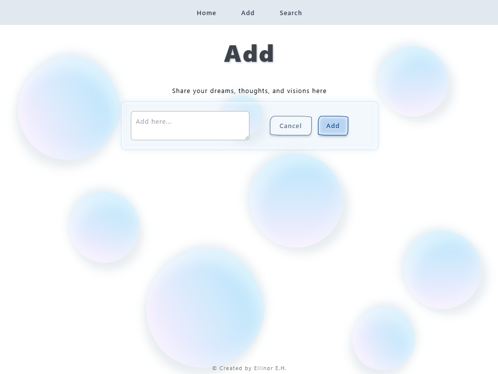
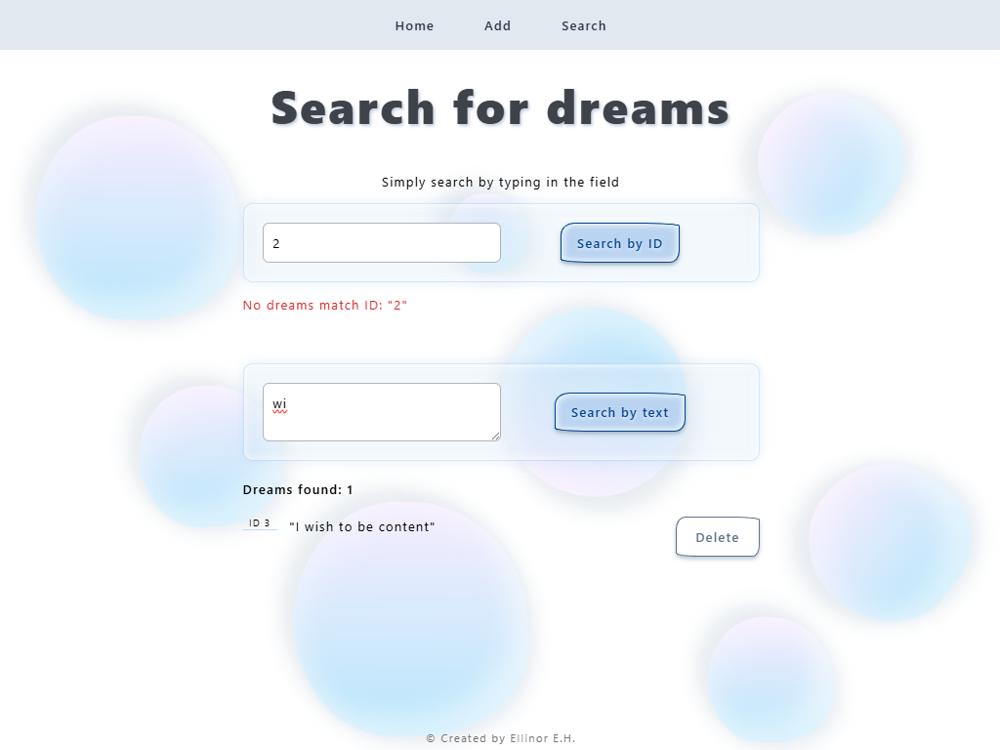

# 🌙 Dreams

Fullstack web application where users can express dreams, thoughts and visions.

Developed initially as a school assignment where the goal was to create a quote manager for Donald Trump (to help admin staff manage his quotes),
this project has since been redesigned into something more personal, positive and universally relevant.

Built with **React + TypeScript** (frontend) and **ASP.NET Core + SQLite** (backend).

---

## 📸 Screenshots

### 🏠 Home Page  
Clean, animated landing page with custom CSS styling.

---

### ➕ Add a Dream  
Form to submit your thoughts or dreams. Stored in the SQLite database.

---

### 🔍 Search Dreams  
Search for dreams by keyword and see real-time filtered results.

---

### 🗃️ Local SQLite DB  
Dreams are saved using Entity Framework Core and displayed via API.

---

## 🧩 Features

- 💭 Add, search, delete, and update your dreams
- 🎨 Aesthetic animated background using custom CSS
- 📦 Persistent data using SQLite
- 🔗 Clean separation of frontend/backend with REST API

---

## 🚀 Tech Stack

### Frontend
- React
- TypeScript
- Tailwind CSS
- Axios

### Backend
- ASP.NET Core
- Entity Framework Core
- SQLite
